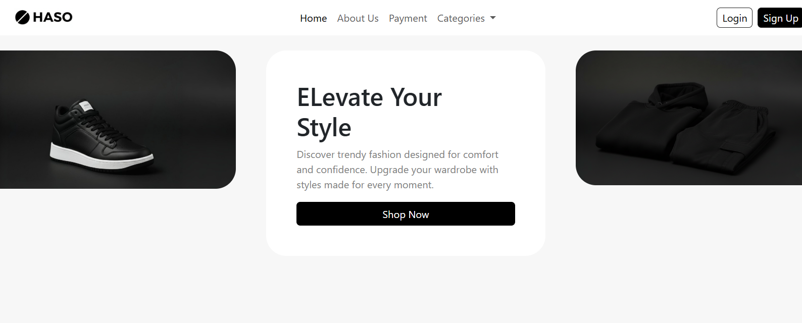

# 👕 HASO – Teenager Clothes Shop

[](#)
[](#)
[](#)
[](#)
[](https://haso-home-page.vercel.app/)

---

## 📖 About

**HASO** is a simple (experimental) teenager clothes shop website built as a **team project** using HTML, CSS, Bootstrap, and JavaScript.
It serves as a **responsive e-commerce landing page**, showcasing categories like **shirts, pants, and sneakers**.

🌐 **Live Demo:** [HASO Website](https://haso-home-page.vercel.app/)

---

## 🛠 Technologies Used

* **HTML5** – page structure
* **CSS3** – custom styling
* **Bootstrap 5** – responsive design & components
* **JavaScript** – interactivity

---

## 👥 Team Members

* **Amr Mousa** – Team Leader
* Mohamed Hassan
* Mohamed Sherif
* Kareen Adel
* Ziad Mohamed

---

## 🚀 Features

✔️ Responsive navbar & layout
✔️ Modern Bootstrap-based UI
✔️ Category showcase with product images
✔️ Works on both desktop and mobile

---

## 📝 How to Run Locally

1. Clone the repo:

   ```bash
   git clone https://github.com/3mrmousa/HASO.git
   ```
2. Open `Home.html` in your browser.
3. (Optional) Use **Live Server** (VS Code extension) for best experience.

---

## 💡 Future Improvements

* Add dedicated product pages with pricing
* Implement shopping cart & checkout system
* Connect with a backend (Node.js / ASP.NET)
* Enhance animations & transitions

---

## 📸 Preview



---

## 📜 License

This project is open-source and free for **learning and collaboration**.
